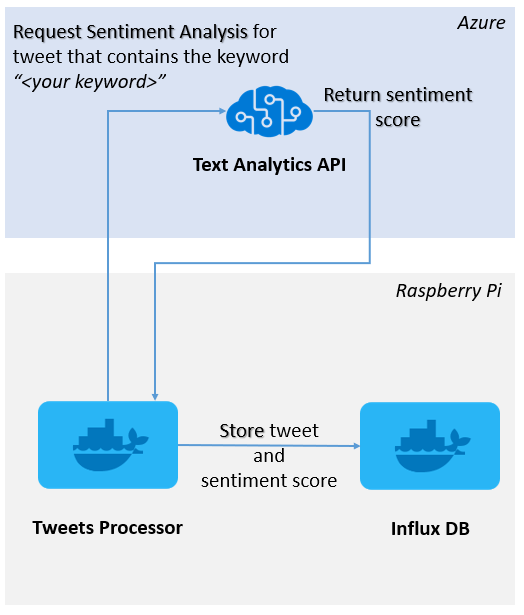

# twitter-analytics-pi

Twitter Analytics running in a Raspberry Pi 3 Model B

# Overview
.NET Core 2.2 Console App which listens for tweets given a keyword on the Twitter Stream feed, performs a sentiment analysis of the tweet using Azure Text Analytics API and stores the tweet and the sentiment score in an Influx DB database. 

# Prerequisites

## Hardware
- A Raspberry Pi 3 Model B with [Raspbian](https://www.raspberrypi.org/downloads/raspbian/) already installed.

## Software
- A Docker installation in your Raspberry Pi. [Tutorial](https://iotbytes.wordpress.com/setting-up-docker-on-raspberry-pi-and-running-hello-world-container/)
- An Influx DB server running in your Raspberry Pi as a [Docker container](https://hub.docker.com/r/hypriot/rpi-influxdb).

# Running your InfluxDB image

Start your image binding the external port 8086 of your containers:

    docker run -d -p 8086:8086 hypriot/rpi-influxdb

# Twitter Analytics configuration setup

Set up the following configuration in the `appsettings.json` and `appsettings.*.json` files with your own values:

    {
      "InfluxDB": {
        "ServerAddress": "http://<INFLUX_DB_SERVER_ADDR>:<INFLUX_DB_PORT>"
      },
      "Twitter": {
        "ConsumerKey": "",
        "ConsumerSecret": "",
        "AccessToken": "",
        "AccessTokenSecret": ""
      },
      "TextAnalytics": {
        "Name": "",
        "Key1": "",
        "Key2": ""
      } 
    }

# Build the Twitter Analytics Docker image

    bash build.sh

# Upload the Docker image to your public or private registry 

    bash push.sh

# Running the container from Twitter Analytics Docker image in the Raspberry Pi

Log into your Raspberry Pi by ssh:

 `λ ssh pi@<YOUR_RASPBERRY_IP_ADDR>`
 
Run the container

  `docker run --rm -e "keyword=climate change" youraccount/twitteranalytics`
  
The container will start listening for tweets that contain the word `climate change` on the Twitter Stream feed and will store them in an Influx DB database.

# See the tweets and sentiment score in your Influx DB

Go inside your Influx DB container:

 `λ docker exec -it <INFLUX_DB_CONTAINER_ID> influx`
 
 ` >  use TwitterAnalytics`
 
 - The tweet information is stored in the `tweet` measurement.
 
 ` > SELECT * FROM tweet`
 
 - The sentiment information is stored in the `sentiment` measurement.
 
 You can see the *average sentiment score* of your tweets running the following query:
 
    > SELECT MEAN(score) FROM sentiment
 
    name: sentiment
    time mean
    ---- ----
    0    0.47096266531824166
